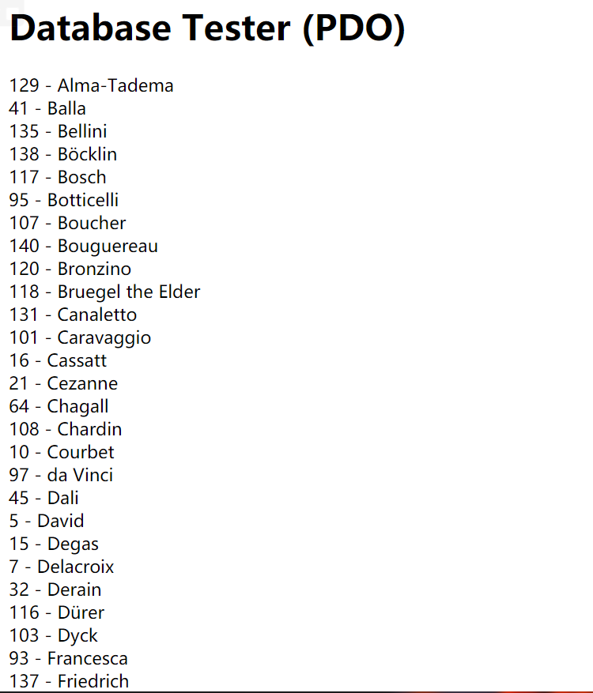
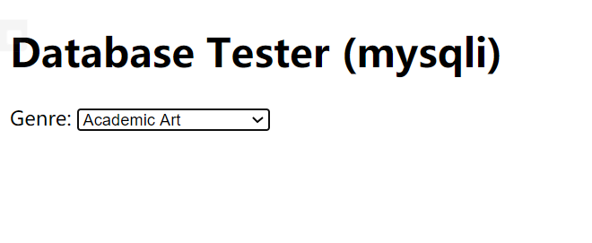
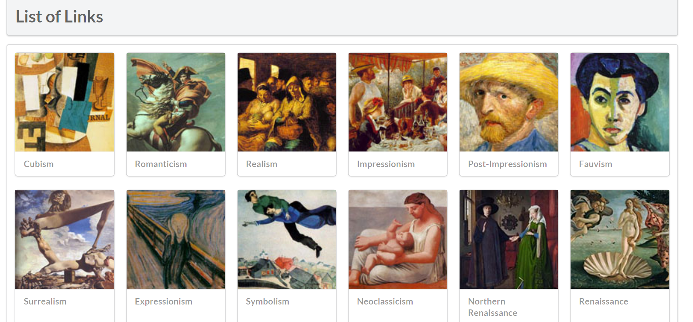
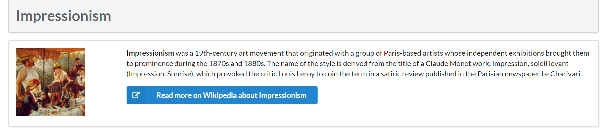

#设计文档

##练习7

 

##练习8

 

以上两种方式都是对数据库中的内容进行访问、读取

通过一个sql命令，从数据库中获取相应信息，再使用`fetch()`或`mysqli_fetch_assoc`，
对获取的信息逐条读取

第一种使用了`PDO`这一API对MySQL进行访问；
第二种使用`MySOLi`这一API进行访问

##练习9

###执行SOL语句的方式

1. 使用`exec()`语句
2. 使用`query()`语句
3. 使用`prepare()`和`execute()`语句进行预处理并执行

###使用预处理的优势

1. 预处理语句针对SQL注入是非常有用的，因为参数值发送后使用不同的协议，保证了数据的合法性。
2. 预处理语句大大减少了分析时间，只做了一次查询（虽然语句多次执行），绑定参数减少了服务器带宽，只需要发送查询的参数，而不是整个语句。

##练习10

 
 

`constructGenreLink()`方法可以根据当前图片生成对应的图片详情页面的连接，并将id信息以`get`方式储存

`outputSingleGenre()`方法可以为每一张传入的图片生成对应的卡片，`outputGenres()`从数据库中按指定排列，
读取内容，并通过调用以上函数，添加到当前页面中。